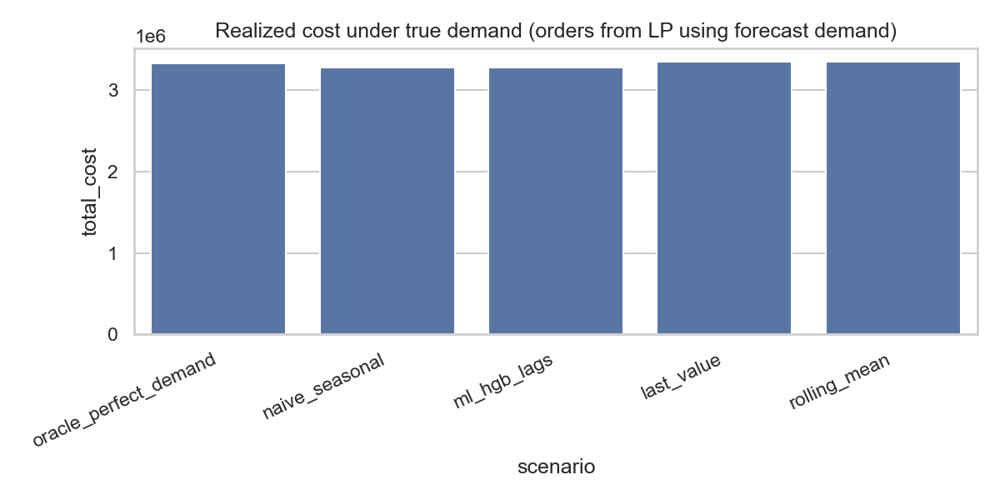

# optimization-ml-hybrid

Predict-then-optimize study: **forecasts feed a constrained inventory LP**, then orders are evaluated under **true** demand.

## Source of truth

**`optimization_ml_hybrid_walkthrough.ipynb`** at the repo root is the **only** place implementation logic lives. Edit and run that notebook. There is no parallel `src/` or `omh/` package to keep in sync.

Supporting pieces (not duplicate logic):

- `config/*.yaml`: costs and experiment knobs the notebook reads.
- **`report.html`** and **`outputs/run_summary.json`** are generated inside **`optimization_ml_hybrid_walkthrough.ipynb`** (Section 9) from CSVs written in Section 7, using Jinja templates under `reports/templates/`.

## Documentation (pick your format)

| What | Who it is for |
|------|----------------|
| **[REPORT.md](REPORT.md)** | Same ESD content as `report.html` in Markdown (offline, no HTML needed). |
| **[report.html](report.html)** | **Single ESD-style report** (open in a browser): problem, stakeholders, requirements + traceability, architecture, detailed design, results, sensitivity, risk register. |
| **[outputs/report.html](outputs/report.html)** | Same report with image paths relative to `outputs/`. |
| **[outputs/run_summary.json](outputs/run_summary.json)** | Machine-readable KPIs. |
| **`optimization_ml_hybrid_walkthrough.ipynb`** | **Run this** for the full pipeline. |

### Figures and outputs on GitHub

These paths are meant to stay **committed** so anyone browsing the repo on GitHub can open tables, JSON, HTML, and the main chart without cloning first:

| Path | What it is |
|------|------------|
| [`outputs/cost_by_scenario.png`](outputs/cost_by_scenario.png) | Bar chart of realized total cost by scenario (same plot Section 7 writes). |
| [`outputs/decision_regret_vs_oracle.png`](outputs/decision_regret_vs_oracle.png) | Regret vs oracle benchmark on realized total cost (%), forecast scenarios only. |
| [`outputs/forecast_error_mae_rmse.png`](outputs/forecast_error_mae_rmse.png) | MAE and RMSE vs truth on the test window, by scenario. |
| [`outputs/sensitivity_naive_cost.png`](outputs/sensitivity_naive_cost.png) | Stress sweep: cost and fill vs demand multiplier (naive plan fixed). |
| [`outputs/kpi_comparison.csv`](outputs/kpi_comparison.csv) | KPI table behind the figure. |
| [`outputs/decision_metrics.csv`](outputs/decision_metrics.csv) | Forecast error (MAE/RMSE) and regret vs oracle. |
| [`outputs/sensitivity_naive_forecast.csv`](outputs/sensitivity_naive_forecast.csv) | Stress sweep on naive-based plan. |
| [`outputs/run_manifest.json`](outputs/run_manifest.json) | Run metadata (SKUs, periods, cutoff, `planning_mode`, etc.). |
| [`outputs/run_summary.json`](outputs/run_summary.json) | Machine-readable rollup including `kpi_comparison`. |
| [`outputs/report.html`](outputs/report.html) | ESD-style HTML (PNG paths relative to `outputs/`). |
| [`report.html`](report.html) | Same report from repo root (images use `outputs/…` paths). |

**What each figure is for** (details in **`REPORT.md`** and in **`report.html`** Section 6–7):

- **`cost_by_scenario.png`** — Ranks scenarios on realized simulator cost; read with the KPI table and the LP vs simulator caveat.
- **`decision_regret_vs_oracle.png`** — Regret vs oracle (%); negative means beat oracle on this simulator in this split.
- **`forecast_error_mae_rmse.png`** — Statistical forecast error; compare to regret: better RMSE does not guarantee lower cost.
- **`sensitivity_naive_cost.png`** — Fixed naive plan, scaled true demand; cost and fill vs multiplier without re-optimization.

**Preview on the repo home page:**



After changing config or re-running the notebook, **Run All** through Section 9 (or set `export_html: false` in `config/experiment.yaml` to skip HTML in CI). Commit updated `outputs/*` (including the PNGs above), **`report.html`**, and root **`report.html`** when you want a frozen snapshot for visitors.

## How to run (local)

```text
python -m venv .venv
.venv\Scripts\activate
pip install -r requirements.txt
```

Start Jupyter from the **repository root**, open **`optimization_ml_hybrid_walkthrough.ipynb`**, choose the `.venv` kernel, **Run All**.

## Tests

The suite **executes the walkthrough notebook** (slow, a few minutes). Skip when iterating:

```text
set SKIP_NOTEBOOK_E2E=1
python -m pytest tests -q
```

Full check:

```text
python -m pytest tests -q
```

## Why not end-to-end RL?

Reinforcement learning shines when a cheap, faithful simulator exists and exploration is safe. This repo optimizes for **auditability**: linear constraints, modular `predict → optimize → simulate`, and plots a reviewer can question. RL is a natural extension when the simulator is trusted.

## Optimization stack (no paid solvers)

The planning model is a **linear program** (PuLP + bundled CBC). Fixed ordering costs in simulation are documented in `REPORT.md`.

## Predict-then-optimize caveat

Realized fill and cost use **true** demand; the LP service rule binds on **forecast** demand. See `REPORT.md`.

## Runtime

Default config (`n_skus=48`, `n_periods=104`) is on the order of tens of seconds per full notebook run, depending on hardware.
